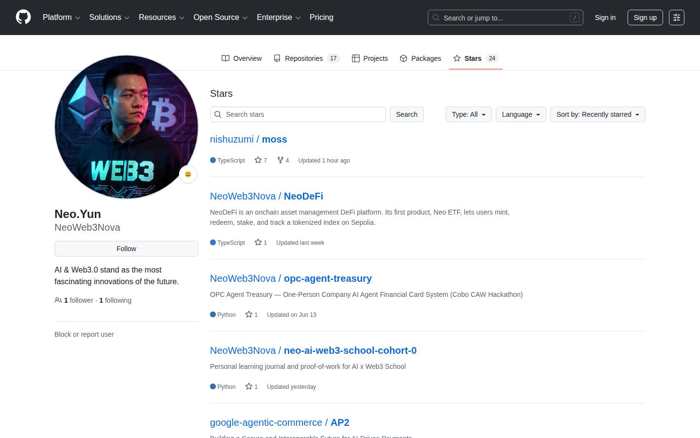

# Week 2｜Challenge｜认识一个开源项目：Moss

> 学员：Neo  
> GitHub 用户：NeoWeb3Nova  
> 日期：2026-07-14  
> 项目方向：Dev Builder（Tech）  
> **2026-07-20 勘误：** 下文「核心能力」原按 Plan/expects 撰写；现行架构见  
> [`moss-architecture-errata.md`](./moss-architecture-errata.md) 与修订稿 v2。

## 提交材料

### 1. GitHub 用户主页

https://github.com/NeoWeb3Nova

### 2. 已 Star Moss 的证明

公开 Star 记录：

https://github.com/NeoWeb3Nova?tab=stars

### 3. 100～200 字分享（2026-07-20 同步新架构）

> Moss 把 Monad 协议交互封装成 discover → load → action → simulate：生成未签名 Capability 树，再经仿真 Changes 与 Receipt 穷尽解析；任意 Warning 即停，签名权留给钱包与用户。可用于 DeFi 助手、金库策略与 Agent 钱包之间的签名前验证层。

（历史 Week 2 原文保留在 git 历史中；上段为现行公开表述。）

### 4. Moss 开源贡献 PR

- PR：[`fix(core): reject unsafe numeric uint inputs`](https://github.com/nishuzumi/moss/pull/36)
- GitHub 主页：https://github.com/NeoWeb3Nova
- Commit：[`865fa71`](https://github.com/NeoWeb3Nova/moss/commit/865fa71c5224ccbd401e002c8480c8e64013c2a2)
- 分支：`NeoWeb3Nova:fix/unsafe-numeric-uint`
- 贡献类型：Core Bug Fix + Regression Tests + Changeset
- 完整证据：[`moss-open-source-contribution-evidence.md`](./moss-open-source-contribution-evidence.md)
- 当前状态：PR 已提交；GitHub Actions 正等待 Maintainer 批准运行，尚未收到 Review 或 Merge。

---

## 项目简介

Moss 是一个面向 Monad 的 AI Agent 链上协议交互框架。它把不同 DApp 和协议的复杂调用统一为可发现、可加载、可执行、可模拟的能力，让 Agent 使用人类可读参数生成未签名交易，而不是直接处理 ABI、合约地址、calldata、代币精度及多步骤清理逻辑。

## 核心问题

AI Agent 能理解用户意图，却不适合临时拼装高风险链上交易。一次看似简单的 Swap 可能涉及 Router 地址、代币包装、授权额度、滑点、退款和多笔调用；只要其中一项“几乎正确但不完全正确”，就可能造成资产损失。同时，交易正确执行了自身声明的动作，也不代表它符合用户原始意图。

## 核心能力（现行 · Capability/Receipt）

1. **discover**：按用户视角动词查找协议能力（swap、wrap、transfer…）。
2. **load**：读取 intent、风险标签、参数类型契约与字段说明。
3. **action**：协议适配器生成 **Capability 树**（未签名；可嵌套子能力，如 approve）。
4. **simulate**：`debug_traceCall` 回放 → 有序 Changes → Receipt 穷尽覆盖校验。
5. **安全停机**：revert、覆盖失败、解析失败等 Warning 时 halt，禁止签名。
6. **签名隔离**：永不签名、永不发送；Agent 用有序 Receipt 文字做 intent alignment。

> 旧版 Plan + quantified expects 已退役，详见勘误索引。

## 可能应用场景

- DeFi 交易助手：在 Swap、Wrap、转账前自动生成并验证交易。
- 自动化金库：执行再平衡、收益领取和资产配置前检查资金流与授权。
- DAO 财库：为提案执行生成可审计、可模拟的交易计划。
- 跨协议策略：验证 claim → swap → supply 等多步骤链上流程。
- Agent Wallet 安全层：作为 AI Agent 与钱包签名器之间的交易验证网关。
- 协议接入市场：通过标准化 Adapter 让更多 Monad 协议被 Agent 安全调用。

## 我的理解

Moss 的关键价值不是“让 Agent 更方便地发交易”，而是把 Agent 从不可靠的交易拼装者，降级为受约束的意图协调者。协议适配器负责正确构建，模拟器负责机械对账，Agent 负责检查结果是否符合用户原意，钱包和用户保留最终签名权。这种职责分离比单纯增加 Prompt 规则更可靠，也更适合承载真实资产。

## 参考链接

- Moss GitHub：https://github.com/nishuzumi/moss
- README：https://github.com/nishuzumi/moss/blob/main/README.md
- Getting Started：https://github.com/nishuzumi/moss/blob/main/docs/getting-started.md
- MCP Tools：https://github.com/nishuzumi/moss/blob/main/docs/mcp-tools.md
- Agent Skill Guide：https://github.com/nishuzumi/moss/blob/main/docs/agent-skill.md
- 本地深度学习笔记：`experiments/moss/MOSS-STUDY-NOTES.md`
