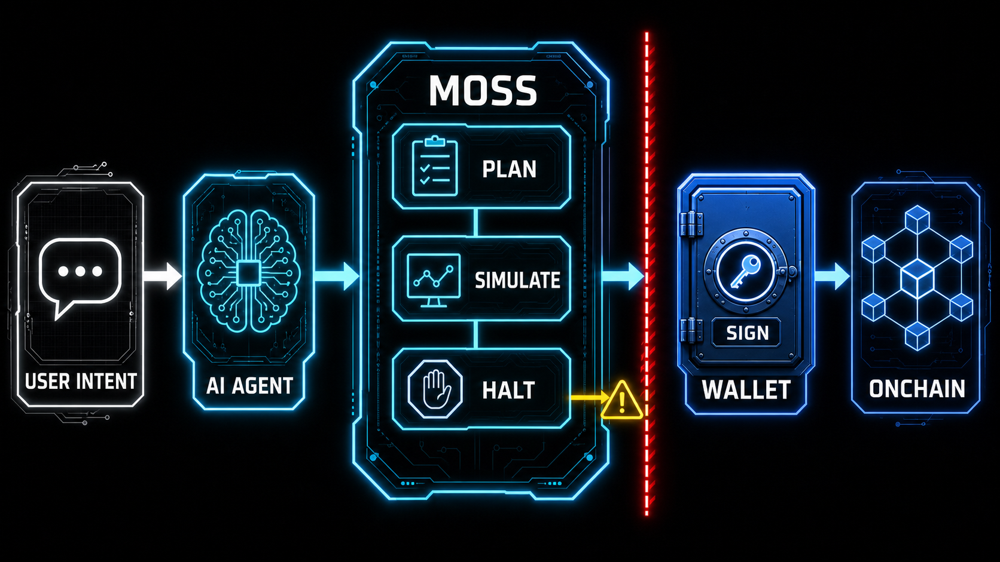
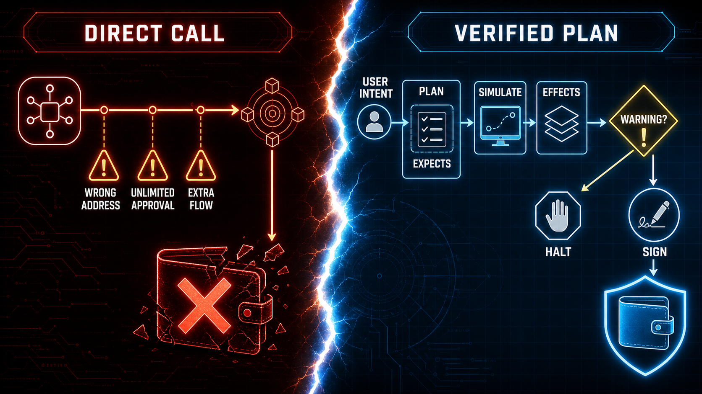
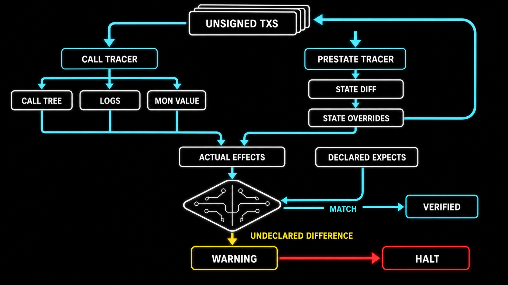
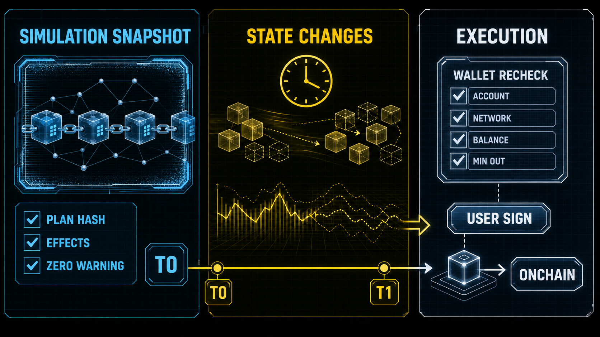

# 为什么 AI Agent 需要 Moss：把链上执行从「相信 AI」变成「签名前验证」（v2 · Capability/Receipt）

> **修订版 · 2026-07-20**  
> 对齐上游 Capability Tree + Exhaustive Receipt（#31）。  
> Week 2 历史稿：[`moss-wechat-article.md`](./moss-wechat-article.md)（Plan/expects 叙事，仅作留证）  
> 勘误总表：[`moss-architecture-errata.md`](./moss-architecture-errata.md)

> AI Agent 可以理解「帮我把 1 MON 换成 USDC」，但理解一句话，不等于能安全地完成一笔链上交易。Moss 真正解决的，不是让 Agent 更快发交易，而是让每一笔交易在签名前都可构建、可解释、可模拟、可叫停。

如果你对 AI Agent 说：

> 「帮我在 Monad 上把 1 MON 换成 USDC。」

这句话对人很简单，对执行系统却一点也不简单。

Agent 必须知道：调用哪个协议、地址是否正确、是否要 wrap、小数位多少、是否要授权、授权给谁、滑点如何限制，以及执行后**实际上**发生了哪些资金与事件变化。

传统 Agent 擅长生成文本和调工具，但链上交易容不得「大概正确」。错误地址、无限授权、精度错误、或未被看见的额外资金移动，都可能造成不可逆损失。

这正是 Moss 想解决的问题。

## 一、Moss 是什么？

Moss 是面向 Monad 的 AI Agent 链上协议能力层。它把不同 DApp 交互抽象成统一流程：

```text
discover → load → action → simulate
```

- Agent 用人类可读参数表达意图  
- 协议适配器构建**未签名** Capability 树  
- 模拟器在真实链上状态上回放，抽出有序 **Changes**  
- Receipt 解析器把 Changes 翻译成结构化结果与文字  
- 覆盖校验失败或 revert → **Warning → 停止**  

职责边界：

- 构建交易，但不签名  
- 模拟交易，但不发送  
- 暴露可核对证据，但不替用户做最终决定  
- 发现 Warning，就在签名前停下  

因此 Moss **不是钱包**，也不是自动交易机器人。它是 Agent 与钱包签名器之间的「协议能力层 + 签名前验证层」。



Moss 仍处 Alpha，目标网络 Monad 主网（chainId 143），已支持 WMON、通用 ERC-20/721、Kuru 等。未经安全审计，**API 与内部模型会演进**（本文已按 2026-07 Capability/Receipt 框架修订），不应描述为成熟生产基础设施。

## 二、它解决的不是「不会调用」，而是「不能验证」

很多框架已经能调合约。问题在于：调用成功只证明没回滚，不能证明符合用户意图。

假设 Swap 工具返回两笔交易：授权 + 调 Router。仅检查「能不能执行」回答不了：

- 授权额度是否过大？spender 是否正确？  
- 用户最多同意付出多少、至少应收到多少？  
- 是否发生了**未被解释**的转账或事件？  
- 交易做了适配器编码的事，但这真是用户要的吗？  

Moss 把两层检查拆开：

1. **机械层（模拟器 + Receipt）**：仿真产生的 Changes 必须被穷尽、按序解析；  
2. **语义层（Agent）**：有序 Receipt 文字必须与用户原话对齐（intent alignment）。  

这比只靠 Prompt「小心一点」可靠：程序负责证据完整性，Agent 负责意图一致性，钱包负责最终签名。



> 配图若仍写「Plan / expects」，请在心中替换为 **Capability 树 / Changes+Receipt**；视觉资产可后续重渲。

## 三、四步工作流：从意图到可验证证据

### 1. discover：先找能力，不猜合约

按用户视角动词搜索：`swap`、`wrap`、`transfer`、`supply`…  
WMON 合约函数可能是 `deposit()`，用户意图却是 `wrap`。Agent 面向资金动作，而不是各协议函数命名。

### 2. load：读取调用契约

- intent  
- 风险标签（如 `fundOut`、`approval`、`priceImpact`）  
- 每个参数的**值类型契约**与**字段角色说明**  
- 金额可用 `"1.5"` 这类人类可读小数  

**代币身份规则（现行）：** 使用明确 EVM 地址或 `native`，**不要**用 `"USDC"` 这类符号当链上身份。Trusted / Package label 只用于 Receipt 文案展示，不替代地址。

### 3. action：生成 Capability 树，不是 Plan

`action` 不发送交易，返回一棵树，概念上：

```json
{
  "kind": "capability",
  "protocol": "kuru",
  "method": "swap",
  "params": { "tokenIn": "native", "tokenOut": "0x…", "amountIn": "1", "slippage": 50 },
  "children": [
    { "kind": "capability", "protocol": "erc20", "method": "approve", "children": ["…tx…"] },
    { "kind": "transaction", "transaction": { "from": "…", "to": "…", "data": "…", "value": "…" } }
  ]
}
```

硬规则：

- 每个 Capability **恰好一笔** direct unsigned transaction  
- 额外步骤必须是**嵌套子 Capability**  
- Core 做 DFS 压平与结构校验  

旧文中的 `expects` / `planHash` **已退役**。证据不再来自作者声明的数量边界，而来自下一步模拟。

### 4. simulate：把可观察执行变成 Receipt

每个写能力树都必须 `simulate`。这是验证之门，不是可选预览。

Simulator 使用 `debug_traceCall`（见 ADR 0002），在链上状态上重放交易，并可把状态差异链式传给后续交易，从而验证「先 approve 再 swap」等多步树。

从成功执行中抽取有序 **Changes**：

- 合约 event（日志）  
- 原生 MON transfer（含调用树中的 value 移动）  

然后调用该 Capability 注册的 **Receipt 解析器**（纯函数）：

- 产出 structured `outcome` + 人类可读 `text`  
- 必须**覆盖全部 Changes**，顺序与对象一致  
- 可委托依赖协议的子 Receipt（如 ERC-20 Transfer）  

失败类型包括（概念上）：revert、trace 失败、顺序不可得、Receipt 解析失败、覆盖不匹配、状态链失败。任一 Warning → **halt**，后续交易不再跑。

核心规则：

> **声明不是证据。** 只有仿真 Changes 经穷尽 Receipt 解析后，才有可交给 Agent 核对的证据。  
> **Any Warning stops the flow.**

库/SDK 可持有完整 Receipt 树；MCP 对 Agent 通常只暴露**有序 leaf texts + warnings**，强制走文字对齐路径。



> 配图若写「expects 对账」，请替换理解：**Changes 穷尽覆盖 + 文本对齐**。

## 四、为什么 AI Agent 尤其需要 Moss？

### 第一，LLM 是概率系统，资产执行需要确定性边界

正确的系统设计默认模型会犯错，并用确定性程序把错误拦在签名前。  
分工：**Agent 理解与协调 · Adapter 正确构建 · Simulator 机械验证 · Wallet 签名 · 用户最终决定。**

### 第二，工具调用成功 ≠ 用户意图实现

1. **Coverage / 解析完整性**（程序）：Changes 是否被穷尽解释？  
2. **Intent alignment**（Agent）：文字是否匹配用户原话？  

零 Warning 只说明「证据解析完整且未在模拟中失败」，**不说明**「做的就是用户要的」。用户说 Swap、Agent 却 supply 了借贷市场——即使 Receipt 自洽，也必须停。

### 第三，签名权必须与推理权分离

Moss 永不持有私钥，永不签名，永不广播。输出始终是**未签名**交易树；钱包再查账户、网络、余额，用户确认。

对真实资产，Agent 最合理的权限不是「替你签名」，而是「生成受约束、可解释、可验证的提案」。

## 五、模拟通过不等于执行结果承诺

模拟使用**当下**链上状态。模拟完成到用户签名之间，价格、流动性、状态都可能变。

零 Warning 不是「一定成功」，更不是收益保证。它只表示在模拟时点：

- 树可执行且 trace 成功  
- Changes 可被对应 Receipt 穷尽解析  
- 未在该路径上发现解析/覆盖/回滚类 Warning  

真正执行仍依赖合约内滑点保护等；钱包须重检。模拟是安全网，不是未来预言机。



Moss 还明确不把「无法在源链模拟完整验证」的能力硬塞进同一安全模型（例如部分跨链效果）。**拒绝做的事**也是安全模型的一部分。

## 六、从读代码到做贡献：我如何理解 Moss

我从 README 四步流程进入，再读 `core`、`simulator`、`erc`、协议模板与 WMON。

真正建立理解的，是看到安全边界如何编码进类型与测试（**现行框架**）：

- `@Capability` 声明 intent / verb / params / risk，并绑定 Receipt 方法名  
- Capability 返回树节点，而不是 `plan() + expects`  
- Receipt 只读 Changes，不查外部状态「补洞」  
- `verifyReceiptCoverage` 强制穷尽与顺序  
- 任意 Warning 触发 halt，不能靠「再模拟一次碰运气」消掉  
- 代币身份拒绝符号猜测  

学习路径上，我做过 MockVault 草稿与 Neverland lending adapter 等练习；上游框架切换后，适配器必须以 **Capability + Receipt** 重写叙事与实现细节。本地活文档见：

- `experiments/moss/docs/architecture-explained.zh-CN.md`  
- `experiments/moss/MOSS-STUDY-NOTES.md`  

开源协作同样是安全的一部分：ADR、ABI origin、测试、changeset、小步 PR，都在减少「看起来差不多」进入主分支的机会。

## 七、Moss 适合哪些场景？

- DeFi 助手：Swap / Wrap / Transfer 前构建并验证  
- 自动化金库：再平衡、领取、调仓前看仿真证据  
- DAO 财库：可模拟、可审计的执行提案  
- 多步骤策略：树内嵌套 approve / swap / supply  
- Agent Wallet：推理层与签名层之间的可验证边界  
- Monad 协议生态：标准 Protocol 包暴露可发现能力  

现阶段更适合研究、测试与贡献，而不是托管大额真实资产。

## 结语：不要让 Agent 更像钱包，要让它更像受约束的提案者

AI Agent 进入 Web3 后，难的不是「能不能调合约」，而是：当它接近真实资产时，我们如何知道它将要做什么、仿真实际看到了什么、偏差时能否停下。

Moss 的答案不是让模型绝对可靠，而是重画职责：

> **Agent 理解意图，协议适配器构建 Capability 树，模拟器与 Receipt 核对仿真证据，钱包保管私钥，用户做最终决定。**

核心价值不是自动化交易，而是把链上执行从「相信 AI」推进到「**签名前验证**」。

这可能才是 AI Agent 真正进入开放金融系统之前，需要补上的基础设施。

---

### 参考资料

- Moss GitHub：https://github.com/nishuzumi/moss  
- 中文 README / Getting started / Agent skill / Security  
- ADR 0002 — Simulation via `debug_traceCall`  
- ADR 0010 — Self-describing protocols and Zod parameters  
- ADR 0011 — Capability trees and exhaustive Receipts  
- ADR 0012 — Kuru market discovery  
- 勘误索引：[`moss-architecture-errata.md`](./moss-architecture-errata.md)  
- 入门修订：[`moss-beginner-guide-v2.md`](./moss-beginner-guide-v2.md)  
- 本地讲解：`experiments/moss/docs/architecture-explained.zh-CN.md`  

**已废止、勿再引用为现行设计：** ADR 0004 quantified expects、0005 token catalog、0006 manifests、0008 observation plane 等（已从主线删除）。

作者：Neo｜Dev Builder（Tech）  
初稿：2026-07-14 · 修订：2026-07-20  
